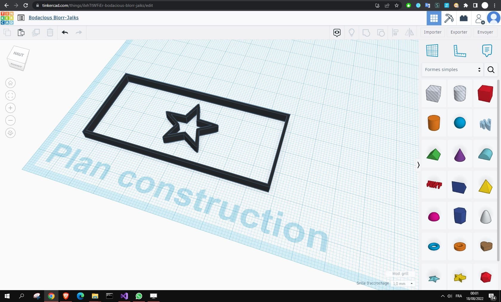

# JPG/PNG to SVG Script - For Windows
Simple poratble PNG to SVG Script for Windows, portable you dont need to install anything. Very Useful if you want draw something on paint and then making it's 3D version

I made this after I started learning 3D conception, i suggest you to start www.tinkercad.com it's free & very good  
This script allows me to draw anything on paint, then with it's SVG version, we can upload it directly on ThinkerCad and then make a 3D version

SVG file uploaded on ThinkerCAD : 

Greetz potrace.sourceforge.net and imagemagick.org
